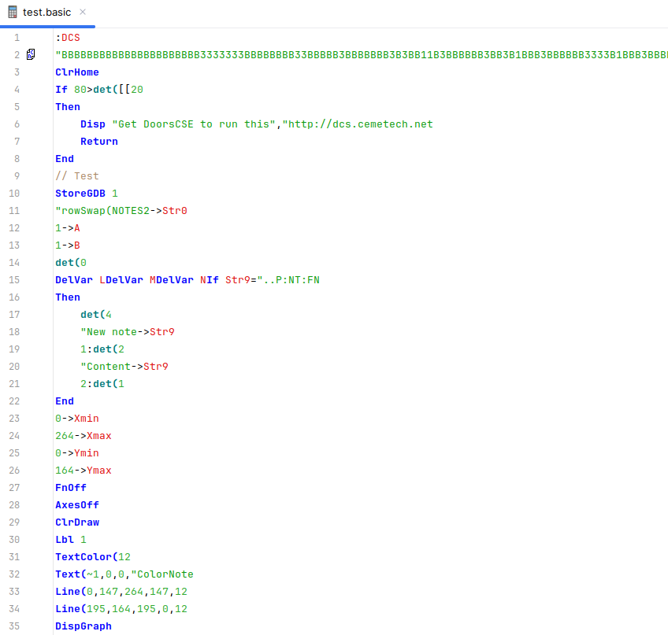
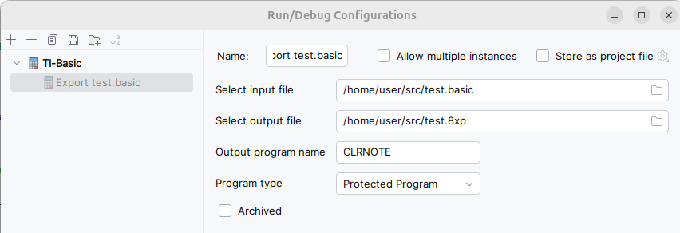
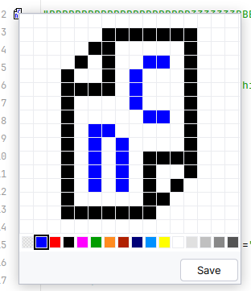

# TI-BASIC IntelliJ plugin
Welcome! This is an IntelliJ plugin for the TI-BASIC language, used for programming the calculator. This plugin
adds many functionalities to the editor, including but not limited to syntax highlighting, folding, DCS icon editor
and exporting the file to an .8xp file.

Here is the full list of specifications:    

 - Syntax checker
 - A bunch of local code inspections
 - Code formatting
 - Folding loops
 - Syntax highlighting
 - SourceCoder3 theme, both dark and light
 - Color scheme editor
 - Code style editor
 - Navigating from/to labels
 - Going to definitions of variables and find references
 - Line commenting
 - TI-OS color gutter provider
 - Highlighting matching braces
 - DCS icon previewer and editor (Cesium-compatible, including monochrome icons)
 - Exporting source to .8xp file with custom settings

The source code can be found here: https://github.com/PeterTillema/TI-Basic-IntelliJ-plugin.

The IntelliJ plugin can be found here: https://plugins.jetbrains.com/plugin/28722-ti-basic.

## Known issues
 - Allow empty Repeat/While loops when the condition contains a function call to getKey
 - Allow chained DelVar with custom list names

## Todo
 - Extend inspections to be more advanced and more complete
 - Write unit/integration tests to test all behavior
